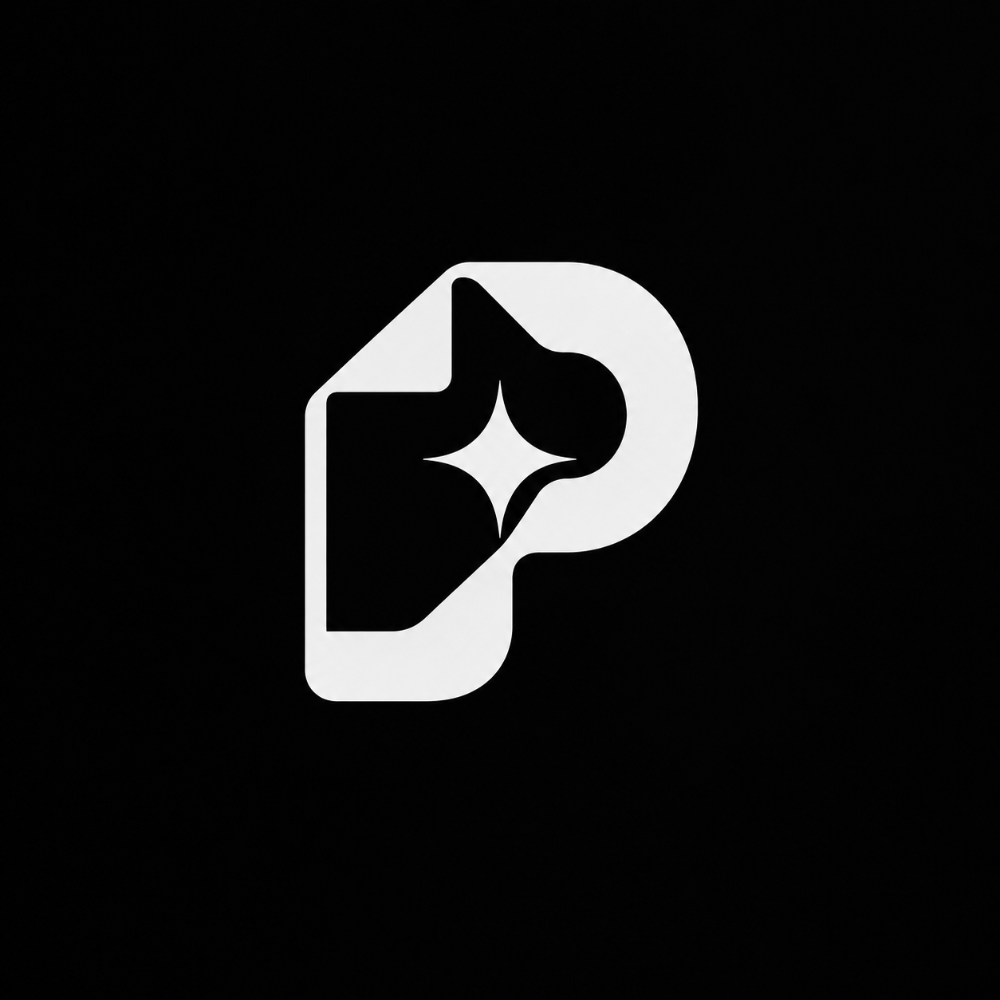
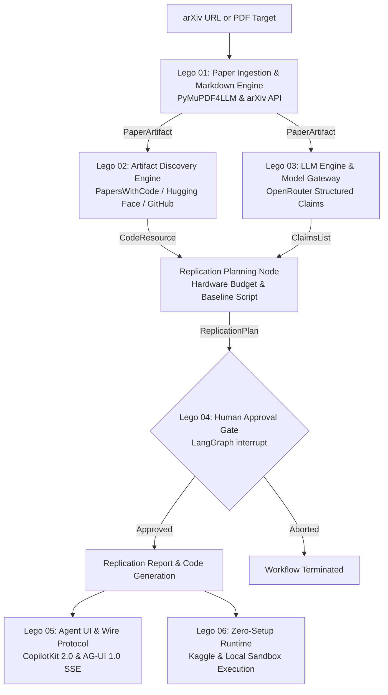

# Zero Gaze

> ML paper to replication plan agent.
> LangGraph agent that reads an arXiv paper and drafts the replication experiment.

<p align="center">
  
</p>

## Overview

Zero Gaze is an autonomous research replication agent built with LangGraph. It converts theoretical machine learning papers into verified, executable experiment plans.

Given an arXiv identifier or PDF link, Zero Gaze extracts empirical benchmark claims and mathematical formulations. It discovers official codebases and datasets across PapersWithCode, Hugging Face, and GitHub. It synthesizes a hardware-aware replication script. An interactive human-in-the-loop checkpoint gates execution. The agent then generates a structured replication report comparing baseline results against original published metrics.



---

## Lego Modules

The architecture is divided into modular Lego pieces. Each module has isolated responsibilities and documented contracts.

| Module | Location | Primary Tech | Responsibility |
| :--- | :--- | :--- | :--- |
| **Lego 01** | [`docs/01-paper-ingestion-lego/`](docs/01-paper-ingestion-lego/README.md) | PyMuPDF4LLM / arXiv API | Ingests arXiv papers and extracts structured markdown with tables and LaTeX. |
| **Lego 02** | [`docs/02-artifact-discovery-lego/`](docs/02-artifact-discovery-lego/README.md) | PapersWithCode / Hugging Face / GitHub | Finds existing code and benchmarks, or generates synthetic baselines. |
| **Lego 03** | [`docs/03-llm-engine-lego/`](docs/03-llm-engine-lego/README.md) | OpenRouter / `langchain-openai` | Routes prompts over free-tier models with Pydantic structured output. |
| **Lego 04** | [`docs/04-agent-graph-lego/`](docs/04-agent-graph-lego/README.md) | LangGraph Python | Orchestrates the state machine, fan-out edges, and human approval gates. |
| **Lego 05** | [`docs/05-agent-ui-agui-lego/`](docs/05-agent-ui-agui-lego/README.md) | CopilotKit 2.0 / AG-UI 1.0 | Streams agent thoughts and exposes interactive approvals to Next.js. |
| **Lego 06** | [`docs/06-kaggle-runtime-lego/`](docs/06-kaggle-runtime-lego/README.md) | Subprocess Sandbox / Kaggle Kernel | Ephemeral execution sandbox and free-tier Kaggle GPU notebook. |

---

## Architectural Invariants

1. **Statically Typed Boundaries.** Graph nodes exchange immutable Pydantic models. Loose dictionaries are prohibited in `AgentState`.
2. **Parallel Fan-Out.** Claim extraction and artifact discovery execute concurrently once paper ingestion completes.
3. **Boundary Resilience.** All external HTTP calls use dedicated gateway clients with timeout limits and exponential backoff retries.
4. **Mandatory Human-in-the-Loop Checkpoint.** The agent pauses execution before code execution. Human operators review and approve compute budgets and execution commands.
5. **Clean Separation of Concerns.** The core agent logic lives in a framework-agnostic Python package. The web interface and execution sandboxes consume this core as a dependency.

---

## Getting Started

### Prerequisites

- Python 3.11 or higher
- OpenRouter API key

### Installation

```bash
# Clone repository
git clone https://github.com/riri-05/zero-gaze.git
cd zero-gaze

# Create virtual environment and install in development mode
python3 -m venv .venv
source .venv/bin/activate
pip install -e ".[dev]"
```

### Environment Configuration

Create a `.env` file in the project root:

```bash
OPENROUTER_API_KEY="your_openrouter_api_key"
OPENROUTER_BASE_URL="https://openrouter.ai/api/v1"
PRIMARY_MODEL="deepseek/deepseek-v4-flash-0731:free"
REASONING_MODEL="qwen/qwen3.8-27b:free"
FAST_MODEL="nvidia/nemotron-3.5-lightning:free"
```

### Command Line Usage

```bash
# Run automated paper replication directly from terminal
zero-gaze replicate 2106.09685 --auto-approve

# Start the FastAPI AG-UI server and web dashboard
zero-gaze serve --host 127.0.0.1 --port 8000
```

Open `http://127.0.0.1:8000` in your browser to interact with the visual dashboard and live Server-Sent Events stream.

### Running the Test Suite

```bash
pytest tests/
```

---

## Project Structure

```
zero-gaze/
├── assets/                               # Static branding assets
│   └── logo.png
├── docs/                                 # Modular Lego architecture blueprints
│   ├── 00-architecture-overview/
│   ├── 01-paper-ingestion-lego/
│   ├── 02-artifact-discovery-lego/
│   ├── 03-llm-engine-lego/
│   ├── 04-agent-graph-lego/
│   ├── 05-agent-ui-agui-lego/
│   └── 06-kaggle-runtime-lego/
├── notebooks/                            # Standalone execution notebooks
│   └── zero_gaze_kaggle_free.ipynb       # Self-contained Kaggle notebook with ipywidgets
├── src/
│   └── zero_gaze/                        # Core Python package
│       ├── cli.py                        # Terminal CLI entry point
│       ├── core/                         # Statically typed Pydantic models & errors
│       ├── ingestion/                    # PyMuPDF4LLM & arXiv API engine
│       ├── discovery/                    # GitHub, HF & synthetic stub generator
│       ├── llm/                          # OpenRouter gateway & structured extractor
│       ├── graph/                        # LangGraph StateGraph & interrupt gate
│       ├── server/                       # FastAPI backend & AG-UI SSE protocol
│       └── execution/                    # Isolated subprocess execution sandbox
├── tests/
│   └── unit/                             # 65 automated unit tests across all 7 modules
├── pyproject.toml                        # Build system, dependencies, and CLI script
├── .gitignore                            # Git ignore rules protecting secrets and caches
└── README.md                             # Project documentation and roadmap
```

---

## Roadmap

Development proceeded across seven verified phases. Each phase was verified through manual smoke testing and unit tests before committing.

- [x] **Phase 0: Architectural Blueprint & Documentation.** Specifications for Lego 01 through Lego 06.
- [x] **Phase 1: Core Foundation & Domain Models.** Pydantic schemas, error definitions, and package configuration.
- [x] **Phase 2: Paper Ingestion Engine.** arXiv API client, PDF stream downloader, and PyMuPDF4LLM parser.
- [x] **Phase 3: Artifact Discovery Engine.** PapersWithCode, Hugging Face, and GitHub search clients with synthetic stub generator.
- [x] **Phase 4: LLM Engine & Routing Gateway.** OpenRouter fallback cascade, model routing matrix, and structured extraction.
- [x] **Phase 5: LangGraph State Machine & Gate.** StateGraph with parallel fan-out, MemorySaver checkpointing, and interrupt handlers.
- [x] **Phase 6: Agent UI & Wire Protocol.** FastAPI backend, AG-UI 1.0 SSE stream endpoint, and Next.js CopilotKit dashboard.
- [x] **Phase 7: Execution Sandbox & Kaggle Runtime.** Isolated execution environment and Kaggle notebook release.
