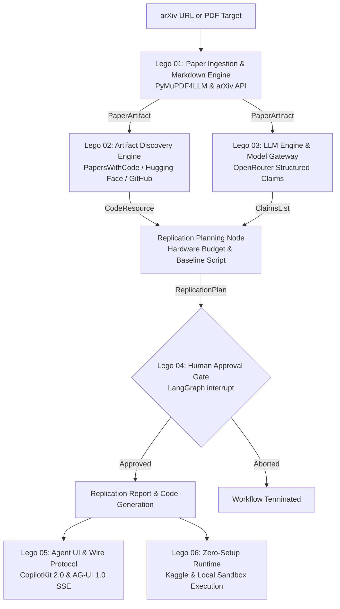

# Zero Gaze

> Autonomous machine learning research replication engine.
> Ingests arXiv papers, discovers reference codebases, extracts empirical claims, and synthesizes verifiable experiment baselines via LangGraph state machines.

<p align="center">
  
</p>

<p align="center">
  <a href="https://github.com/riri-05/zero-gaze"></a>
  <a href="https://github.com/riri-05/zero-gaze"></a>
  <a href="https://github.com/riri-05/zero-gaze"></a>
  <a href="https://github.com/riri-05/zero-gaze"></a>
  <a href="https://github.com/riri-05/zero-gaze"></a>
</p>

---

## Technical Overview

Zero Gaze is a scientific reproduction engine designed to verify machine learning literature at scale. It automates the transition from theoretical academic manuscripts into executable, resource-bounded experiment baselines.

The engine accepts an arXiv identifier or PDF stream. It parses the document hierarchy, extracts empirical claims with statistical metrics, discovers public codebases across open-source hubs, synthesizes executable replication code, gates execution through human operator checkpoints, and executes baselines inside ephemeral sandboxes.



---

## Architectural Invariants

1. **Statically Typed Boundaries.** Graph nodes exchange immutable Pydantic models (`AgentState`). Loose dictionaries are rejected across execution boundaries.
2. **Parallel Fan-Out.** Disjoint operations (`extract_claims` and `find_code_dataset`) execute concurrently once paper ingestion completes, reducing analysis latency.
3. **Boundary Resilience.** All external HTTP queries (arXiv, Hugging Face, GitHub, OpenRouter) route through gateway clients with exponential jitter backoff and circuit-breaking fallbacks.
4. **Mandatory Human-in-the-Loop Checkpoint.** Execution of generated code is gated by a LangGraph interrupt token. Compute resources cannot be allocated without explicit human authorization.
5. **Dual-Surface Delivery.** Every replication feature is executable locally via the `zero-gaze` CLI and FastAPI AG-UI web server, as well as remotely in standalone Kaggle GPU notebooks.
6. **Execution Containment.** Experiment code runs inside ephemeral subprocess sandboxes with strict runtime ceilings and metric extraction parsers.

---

## Subsystem Architecture Index

The architecture is divided into discrete technical modules documented in [`docs/`](docs/):

| Module | Architectural Specification | Provider / Framework | Primary Invariant |
| :--- | :--- | :--- | :--- |
| **Overview** | [`docs/00-architecture-overview/`](docs/00-architecture-overview/README.md) | System Blueprint | Global domain boundaries, event flows, and state machines. |
| **Lego 01** | [`docs/01-paper-ingestion-lego/`](docs/01-paper-ingestion-lego/README.md) | PyMuPDF4LLM / arXiv API | Three-tier recovery hierarchy (`PDF` -> `HTML` -> `Metadata`). |
| **Lego 02** | [`docs/02-artifact-discovery-lego/`](docs/02-artifact-discovery-lego/README.md) | GitHub / Hugging Face / PwC | Idempotent multi-source resolution and synthetic baseline generation. |
| **Lego 03** | [`docs/03-llm-engine-lego/`](docs/03-llm-engine-lego/README.md) | OpenRouter / `langchain-openai` | Automatic cascade failover (`nemotron` -> `qwen` -> `deepseek`). |
| **Lego 04** | [`docs/04-agent-graph-lego/`](docs/04-agent-graph-lego/README.md) | LangGraph StateGraph | Checkpoint persistence via `MemorySaver` and human interrupt gate. |
| **Lego 05** | [`docs/05-agent-ui-agui-lego/`](docs/05-agent-ui-agui-lego/README.md) | CopilotKit 2.0 / AG-UI 1.0 | Real-time Server-Sent Events (SSE) state synchronization. |
| **Lego 06** | [`docs/06-kaggle-runtime-lego/`](docs/06-kaggle-runtime-lego/README.md) | Subprocess Sandbox / Kaggle Kernel | Resource-bounded sandboxed execution and metric extraction grammar. |

---

## Installation & Setup

### Prerequisites

- Python 3.11 or higher
- OpenRouter API key

### Quickstart

```bash
# Clone the repository
git clone https://github.com/riri-05/zero-gaze.git
cd zero-gaze

# Create virtual environment and install in development mode
python3 -m venv .venv
source .venv/bin/activate
pip install -e ".[dev]"

# Configure environment variables
cp .env.example .env
# Edit .env and supply your OPENROUTER_API_KEY
```

---

## Usage Reference

### Command Line Interface

```bash
# Replicate an arXiv paper from terminal with interactive approval
zero-gaze replicate 2106.09685

# Replicate with automatic plan authorization
zero-gaze replicate 2106.09685 --auto-approve

# Start the FastAPI AG-UI web server and dashboard
zero-gaze serve --host 127.0.0.1 --port 8000
```

### Programmatic Python API

```python
from zero_gaze.graph import ZeroGazeRunner
from zero_gaze.core.models.state import HumanDecision

runner = ZeroGazeRunner()

# 1. Start execution up to the human interrupt gate
state, thread_id, is_interrupted = runner.start_replication("2106.09685")

# 2. Inspect synthesized plan and discovered code
print("Discovered Repo:", state["code_resource"].repo_url)
print("Execution Command:", state["plan"].execution_command)

# 3. Authorize experiment execution across the gate
final_state = runner.resolve_approval(
    thread_id=thread_id,
    decision=HumanDecision.APPROVED,
    comments="Authorized for CPU verification",
)
print("Replication Summary:\n", final_state["report"].summary_markdown)
```

### Verification & Test Suite

```bash
# Run the complete test suite across all 7 subsystems
pytest tests/
```

