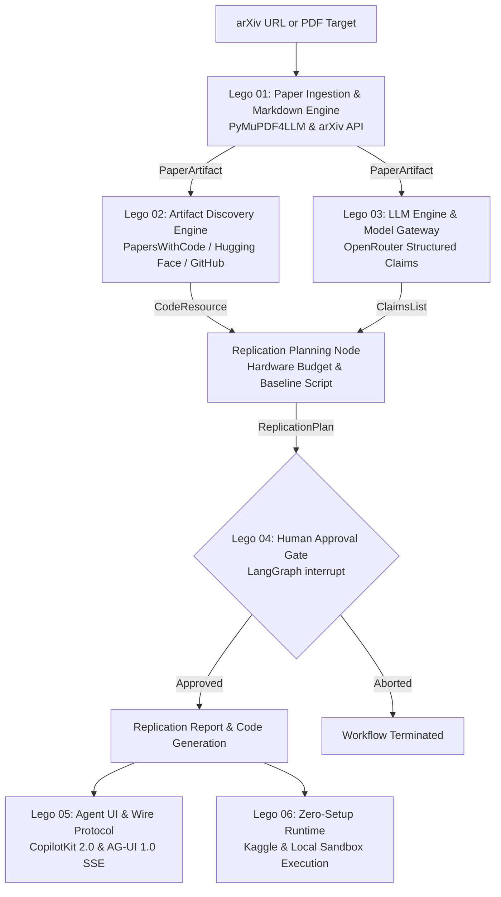

# Zero Gaze — Architecture & Modular Lego System

> **Zero Gaze** — ML paper → replication plan agent  
> *LangGraph agent that reads an arXiv paper and drafts the experiment.*

---

## The Lego Modules Index

| Lego Piece | Module Directory | Upstream Provider | Primary Responsibility |
| :--- | :--- | :--- | :--- |
| **Lego 01** | [`../01-paper-ingestion-lego/`](../01-paper-ingestion-lego/README.md) | arXiv API / PyMuPDF | Ingest arXiv papers and parse PDFs into structured markdown with math and tables. |
| **Lego 02** | [`../02-artifact-discovery-lego/`](../02-artifact-discovery-lego/README.md) | PapersWithCode / Hugging Face / GitHub | Discover existing code implementations, benchmark datasets, or generate synthetic stubs. |
| **Lego 03** | [`../03-llm-engine-lego/`](../03-llm-engine-lego/README.md) | OpenRouter / `langchain-openai` | Route prompts across free-tier models with structured JSON schema outputs. |
| **Lego 04** | [`../04-agent-graph-lego/`](../04-agent-graph-lego/README.md) | LangGraph | Orchestrate nodes, typed state machine, checkpoint persistence, and human interrupt gates. |
| **Lego 05** | [`../05-agent-ui-agui-lego/`](../05-agent-ui-agui-lego/README.md) | CopilotKit 2.0 / AG-UI 1.0 | Connect agent state to Next.js frontend over AG-UI Server-Sent Events protocol. |
| **Lego 06** | [`../06-kaggle-runtime-lego/`](../06-kaggle-runtime-lego/README.md) | Subprocess Sandbox / Kaggle Kernel | Ephemeral execution sandbox and free-tier Kaggle GPU notebook runtime. |

---

## Architectural Invariants

1. **Statically Typed Boundaries.** Graph nodes exchange immutable Pydantic models (`AgentState`), never loose dictionary payloads.
2. **Parallel Fan-Out.** Disjoint nodes (`extract_claims` and `find_code_dataset`) execute concurrently from the ingested paper artifact.
3. **Defensive Fallbacks.** If upstream services fail (such as arXiv HTML missing or PapersWithCode empty), the system falls back gracefully to secondary channels or synthetic baselines.
4. **Mandatory Human-in-the-Loop Checkpoint.** The agent never attempts to execute generated code without explicit human operator confirmation.
5. **Dual-Surface Delivery.** The complete replication pipeline is executable locally via the `zero-gaze` CLI and FastAPI AG-UI web server, as well as remotely inside standalone Kaggle GPU notebooks.
