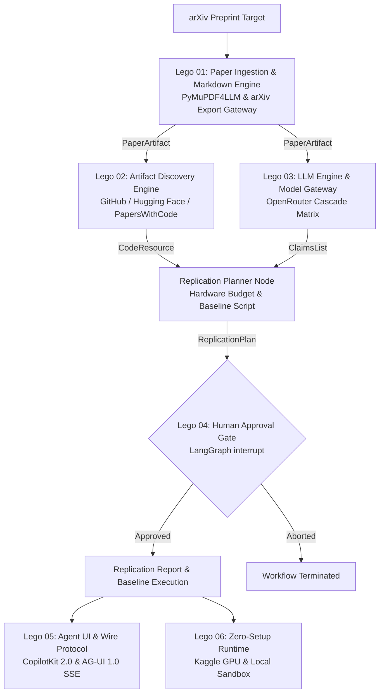
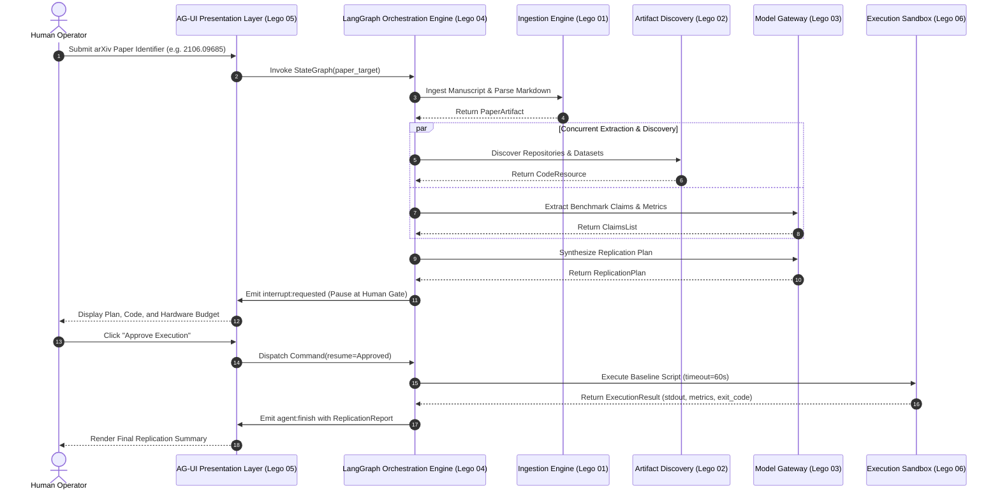

# Zero Gaze — Architecture & Modular Lego System

> Global System Specification & Domain Boundaries  
> An autonomous verification engine converting arXiv preprints into empirical experiments via LangGraph.

---

## 1. System Topology

---

## 2. Domain-Driven Design Bounded Contexts

Zero Gaze is partitioned into five distinct bounded contexts. Each context maintains complete ownership over its internal models and communicates strictly via immutable value objects.

| Bounded Context | Lego Module | Domain Aggregates | External Boundaries |
| :--- | :--- | :--- | :--- |
| **Ingestion Context** | Lego 01 | `PaperArtifact`, `PaperExtractionSource` | arXiv Atom XML API, PDF Binary Streams, ar5iv HTML DOM |
| **Discovery Context** | Lego 02 | `CodeResource`, `RepoStatus` | GitHub Search REST API, Hugging Face Papers API, PapersWithCode |
| **Inference Context** | Lego 03 | `ClaimItem`, `ClaimsList` | OpenRouter OpenAI-Compatible Chat Completions API |
| **Orchestration Context** | Lego 04 | `AgentState`, `HumanApproval`, `ReplicationPlan` | LangGraph StateGraph, Checkpoint Storage (`MemorySaver`) |
| **Presentation Context** | Lego 05 | `AGUIEvent`, `ReplicationStatusResponse` | AG-UI 2.0 SSE Wire Stream, FastAPI Web Server, React 19 Cockpit |
| **Execution Context** | Lego 06 | `ExecutionResult`, `SandboxRunner` | Ephemeral Subprocess Cgroups, PyTorch Runtime, Kaggle T4 Kernel |
| **Operations Context** | Lego 07 | `render.yaml`, `vercel.json`, GitHub Actions | Multi-Cloud Deployment, Vercel Edge CDN, Render Web Service |

---

## 3. Global System Invariants

1. **Statically Typed Boundaries.** Graph nodes exchange immutable models conforming to `AgentState`. Untyped dictionaries or mutable global variables are prohibited across graph edges.
2. **Parallel Fan-Out.** Operations that depend solely on the ingested manuscript (`extract_claims` and `find_code_dataset`) execute concurrently. They join at `plan_baseline`, avoiding serialization latency.
3. **Idempotent Caching.** Upstream repository queries and document extractions are cached by normalized paper identifier. Re-running the pipeline returns identical cached records without consuming external quotas.
4. **Mandatory Human-in-the-Loop Checkpoint.** The engine cannot trigger code execution without an explicit human operator authorization token delivered through `Command(resume=...)`.
5. **Execution Containment.** Generated baseline scripts execute in ephemeral subprocess environments with strict execution timeouts, stdout capture, and metric parsing.

---

## 4. Subsystem Interaction Sequence

---

## 5. Global Failure Domain Matrix

| Subsystem | Failure Trigger | Detection Mechanism | Mitigation Policy | Degraded State |
| :--- | :--- | :--- | :--- | :--- |
| **Ingestion** | arXiv PDF stream unavailable or corrupted | HTTP status != 200 or missing `%PDF` magic bytes | Failover to ar5iv HTML DOM; if unavailable, fallback to title/abstract metadata | `METADATA_FALLBACK` extraction source |
| **Discovery** | GitHub secondary rate limit (HTTP 403/429) | JSON error payload or status code | Query PapersWithCode mirror; if missing, invoke `SyntheticStubGenerator` | `SYNTHETIC_STUB` code baseline |
| **Inference** | OpenRouter free endpoint rate limit (HTTP 429) | HTTP 429 status code | Exponential backoff with jitter; automatic cascade to secondary or tertiary model | Cascade model failover |
| **Orchestration** | State mutation validation error | Pydantic `ValidationError` at node boundary | Catch error, append message to `AgentState.errors`, and halt execution | Unchecked state halt |
| **Execution** | Script infinite loop or excessive memory | Subprocess timeout expiration | Terminate subprocess tree via `SIGKILL` after timeout threshold | `ExecutionResult.success = False` |
