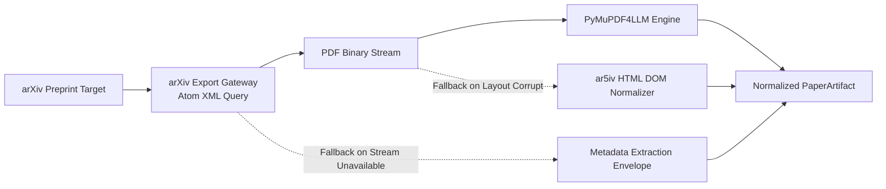

# Lego 01: Paper Ingestion & Document Normalization Engine

> Technical Specification & RFC Protocol  
> Ingestion of unstructured arXiv preprints into normalized Markdown preserving mathematical formulations and tabular benchmarks.

---

## 1. Specification Overview

The **Paper Ingestion Engine** provides deterministic conversion of academic preprints (arXiv URLs, DOIs, or PDF streams) into structured Markdown documents. It extracts mathematical expressions as standardized LaTeX tokens, tabular structures as pipe-delimited data, and builds a hierarchical section tree.



---

## 2. Ingestion Protocol RFC

### 2.1 Identifier Resolution
1. The ingestion gateway MUST accept canonical arXiv identifiers (`2106.09685`, `2106.09685v2`), prefixed URNs (`arXiv:2106.09685`), and valid HTTP/HTTPS URLs pointing to `/abs/`, `/pdf/`, or `/html/` endpoints.
2. The gateway MUST resolve the input string to an alphanumeric identifier matching the pattern:
   ```
   ^(?:arxiv\.org/(?:abs|pdf|html)/|arxiv:)?(\d{4}\.\d{4,5}(?:v\d+)?)|([a-z\-]+(?:\.[a-z]{2})?/\d{7})$
   ```
3. Target identifiers failing resolution MUST raise a typed `IngestionError`.

### 2.2 Transport Invariants
1. All network requests to `export.arxiv.org` MUST supply a custom `User-Agent` header containing the system name and contact repository.
2. The client MUST enforce a minimum connection timeout of 15 seconds.
3. On HTTP 429 (Rate Limit) or 5xx server errors, the client MUST perform exponential backoff with a minimum multiplier of 2.0x across 3 attempts before raising an `IngestionError`.

---

## 3. Data Contract Specification

The Ingestion Context yields an immutable `PaperArtifact` entity conforming to the following formal JSON Schema:

```json
{
  "$schema": "https://json-schema.org/draft/2020-12/schema",
  "title": "PaperArtifact",
  "type": "object",
  "properties": {
    "paper_id": {
      "type": "string",
      "description": "Canonical alphanumeric arXiv preprint identifier"
    },
    "title": {
      "type": "string",
      "description": "Normalized paper title with whitespace and linebreaks collapsed"
    },
    "authors": {
      "type": "array",
      "items": { "type": "string" },
      "description": "Ordered list of contributing authors"
    },
    "published_date": {
      "type": ["string", "null"],
      "format": "date-time",
      "description": "ISO 8601 publication timestamp from preprint repository"
    },
    "abstract": {
      "type": "string",
      "description": "Complete abstract text extracted from Atom XML metadata"
    },
    "pdf_url": {
      "type": "string",
      "format": "uri",
      "description": "Direct canonical URI to the source PDF binary"
    },
    "full_text_markdown": {
      "type": "string",
      "description": "High-fidelity Markdown stream preserving LaTeX math and tables"
    },
    "extraction_source": {
      "type": "string",
      "enum": ["pymupdf_markdown", "arxiv_html", "metadata_fallback"],
      "description": "Enumerated provenance of the extracted text"
    },
    "section_headers": {
      "type": "array",
      "items": { "type": "string" },
      "description": "Ordered hierarchy of extracted document section headings"
    },
    "tables": {
      "type": "array",
      "items": {
        "type": "object",
        "properties": {
          "headers": { "type": "array", "items": { "type": "string" } },
          "rows": { "type": "array", "items": { "type": "object" } },
          "row_count": { "type": "integer" }
        },
        "required": ["headers", "rows", "row_count"]
      },
      "description": "Structured benchmark tables extracted from Markdown pipe blocks"
    }
  },
  "required": [
    "paper_id",
    "title",
    "authors",
    "abstract",
    "pdf_url",
    "full_text_markdown",
    "extraction_source"
  ]
}
```

---

## 4. Document Normalization Rules

### 4.1 Page-Bounded Core Extraction
Academic preprints typically place primary methodologies, benchmark results, and conclusion summaries within the initial 8 to 12 pages. Appendices, bibliography, and raw proofs populate trailing pages.
- The PDF parser bounds extraction to `max_pages = 8` to avoid heavy vector OCR stalls.
- Embedded vector graphics and non-text visual artifacts are bypassed via `ignore_graphics = True` and `ignore_images = True`, accelerating parse latency from 300 seconds to under 3 seconds.

### 4.2 Tabular Data Grammar
Tabular benchmarks are detected and parsed through a stateful line-scanner:
1. Lines matching `^\s*\|(.+)\|\s*$` are accumulated into an active table buffer.
2. The second line MUST match the Markdown separator syntax `^[\|\s\-:]+$`.
3. Table lines are flushed into structured row dictionaries mapping header columns to cell values.

---

## 5. Three-Tier Recovery SLA Matrix

| Tier | Strategy | Trigger Condition | Output Source | Recovery Guarantee |
| :--- | :--- | :--- | :--- | :--- |
| **Tier 1** | Primary PyMuPDF4LLM | Valid PDF stream with text layer | `pymupdf_markdown` | Preserves LaTeX equations, tables, and section structure |
| **Tier 2** | ar5iv HTML DOM | Corrupted PDF bytes, zero text layer, or OCR stall | `arxiv_html` | Structured HTML headings, paragraphs, and lists converted to Markdown |
| **Tier 3** | Metadata Envelope | Network failure on document bodies or non-existent PDF | `metadata_fallback` | Guaranteed delivery of paper title, authors, and abstract |
