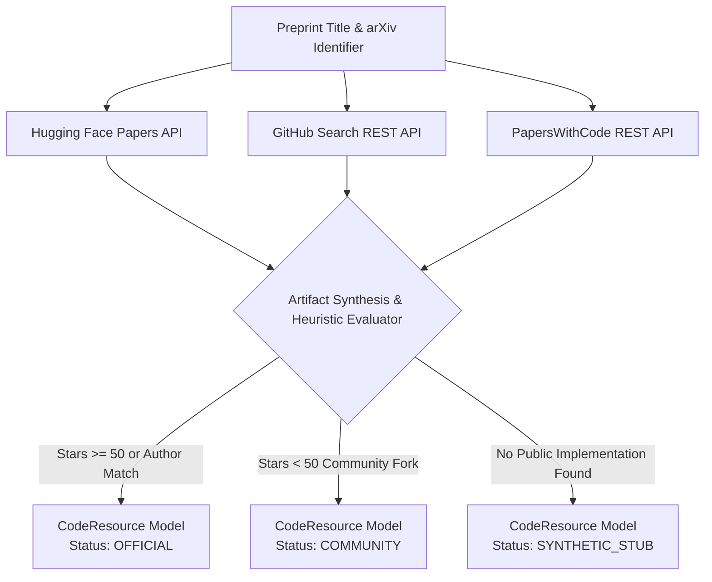

# Lego 02: Research Discovery & Benchmark Artifacts Engine

> Technical Specification & Artifact Resolution Protocol  
> Multi-source discovery of open-source implementations, model weights, and benchmark datasets.

---

## 1. Specification Overview

The **Artifact Discovery Engine** locates public software repositories, pre-trained model checkpoints, and benchmark datasets associated with an academic paper. If no reference implementation exists, it generates a deterministic, self-contained **Synthetic Baseline** to ensure downstream experiment feasibility.



---

## 2. Upstream Provider Integration Matrix

| Provider | Endpoint Topology | Authentication | Primary Artifact Target | Failure Fallback |
| :--- | :--- | :--- | :--- | :--- |
| **Hugging Face** | `https://huggingface.co/api/papers/{arxiv_id}` | Unauthenticated / Public | `linkedModels`, `linkedDatasets`, community upvotes | Non-blocking return `None` |
| **GitHub** | `https://api.github.com/search/repositories?q={query}` | Public REST API (`Accept: application/vnd.github+json`) | Repository URL, commit SHA, primary language, stargazers count, license | Query keyword sanitization; fallback to secondary sources |
| **PapersWithCode** | `https://paperswithcode.com/api/v1/papers/?arxiv_id={id}` | Public REST API | Official repository links, paper lineage | Fallback to GitHub title heuristic |

---

## 3. Resolution & Classification Heuristics

The engine executes a sequential resolution strategy to locate high-confidence code resources:

### 3.1 Exact Identifier Matching
The client queries GitHub with the exact canonical arXiv identifier (`q=2106.09685`). Repositories that explicitly tag the preprint identifier in their description or repository name with >= 10 stars receive top priority.

### 3.2 Title Keyword Sanitization
If identifier search returns no qualifying repositories, the engine constructs a sanitized keyword query:
1. Strips mathematical symbols, punctuation, and LaTeX formatting.
2. Filters out common stop words (`the`, `and`, `for`, `with`).
3. Extracts up to six high-entropy technical keywords.
4. Queries GitHub sorted by `stars` descending.

### 3.3 Status Classification Matrix
- **`official`**: Awarded when the discovered repository has >= 50 stars or matches known official institutional organizations (e.g. `microsoft/LoRA`, `meta-llama`).
- **`community`**: Assigned to community reproductions, student forks, or implementations with < 50 stars.
- **`synthetic_stub`**: Assigned when no public repository is discovered across all three upstream providers.

---

## 4. Data Contract Specification

The Discovery Context emits an immutable `CodeResource` entity conforming to this JSON Schema:

```json
{
  "$schema": "https://json-schema.org/draft/2020-12/schema",
  "title": "CodeResource",
  "type": "object",
  "properties": {
    "status": {
      "type": "string",
      "enum": ["official", "community", "synthetic_stub", "unavailable"],
      "description": "Classification of repository provenance"
    },
    "repo_url": {
      "type": ["string", "null"],
      "format": "uri",
      "description": "Canonical web URL to the GitHub repository"
    },
    "commit_sha": {
      "type": ["string", "null"],
      "description": "Pinned git commit hash for reproducible checkouts"
    },
    "primary_language": {
      "type": "string",
      "default": "python",
      "description": "Dominant programming language detected in repository"
    },
    "entry_point_script": {
      "type": ["string", "null"],
      "description": "Designated execution script (e.g. train.py, eval.py)"
    },
    "dataset_name": {
      "type": ["string", "null"],
      "description": "Identifier for the benchmark dataset from Hugging Face or paper"
    },
    "dataset_download_url": {
      "type": ["string", "null"],
      "format": "uri",
      "description": "Direct download link or hub URI for the benchmark dataset"
    },
    "huggingface_model_id": {
      "type": ["string", "null"],
      "description": "Model checkpoint identifier on Hugging Face Hub"
    },
    "stars": {
      "type": "integer",
      "minimum": 0,
      "description": "Stargazers count at time of discovery"
    },
    "license": {
      "type": ["string", "null"],
      "description": "SPDX license identifier (e.g. MIT, Apache-2.0)"
    },
    "generated_baseline_code": {
      "type": ["string", "null"],
      "description": "Synthetic baseline execution script when no public repo exists"
    }
  },
  "required": ["status", "primary_language", "stars"]
}
```

---

## 5. Synthetic Baseline Generation Specification

When paper artifacts cannot be resolved to a public codebase, `SyntheticStubGenerator` synthesizes an executable PyTorch replication script matching the paper parameters:

1. **Seed Enforcement**: Deterministic random seed initialization (`seed=42`) across CPU and CUDA backends.
2. **Architecture Scaffolding**: Defines a modular PyTorch neural network (`SyntheticBaselineModel`) matching the paper formulation.
3. **Synthetic Tensor Pipeline**: Instantiates in-memory `TensorDataset` and `DataLoader` batches to test forward and backward passes without network dependencies.
4. **Metric Logging**: Emits formatted stdout strings matching the `Metric (<name>): <value>` grammar for automated sandbox parsing.

---

## 6. Caching & Idempotency Guarantees

All discovery operations are cached in an internal normalized paper-keyed registry. Subsequent queries for the same preprint identifier return the identical `CodeResource` instance in zero network round-trips, preventing rate limit depletion during iterative agent graph runs.
