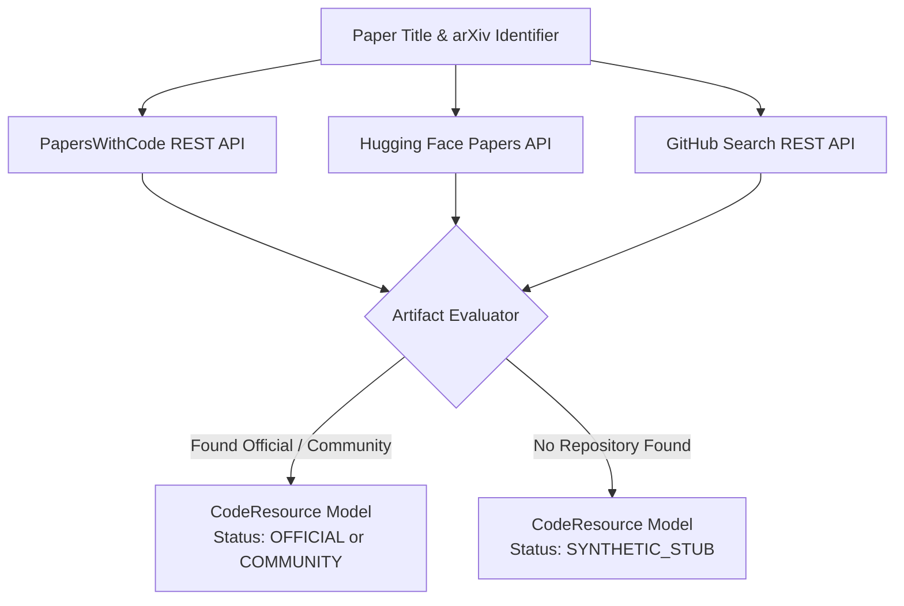

# Lego 02: Research Discovery & Benchmark Artifacts Engine

## 1. Overview & Responsibility
The **Research Discovery & Benchmark Artifacts Engine** discovers open-source artifacts associated with an academic paper. It queries PapersWithCode, Hugging Face, and GitHub to locate:
1. Official code repositories and reference implementations.
2. Verified benchmark datasets and download links.
3. Pretrained model checkpoints and weights.

If no existing code exists, this module creates a structured **Synthetic Stub** to guarantee replication feasibility.



---

## 2. Official Provider Documentation Links
- **PapersWithCode REST API Reference:** [`https://paperswithcode.com/api/v1/docs/`](https://paperswithcode.com/api/v1/docs/)
- **PapersWithCode Client Repository:** [`https://github.com/paperswithcode/paperswithcode-client`](https://github.com/paperswithcode/paperswithcode-client)
- **Hugging Face Hub API Documentation:** [`https://huggingface.co/docs/hub/api`](https://huggingface.co/docs/hub/api)
- **Hugging Face Daily Papers API:** [`https://huggingface.co/api/daily_papers`](https://huggingface.co/api/daily_papers)
- **GitHub Search API Documentation:** [`https://docs.github.com/en/rest/search/search`](https://docs.github.com/en/rest/search/search)

---

## 3. Data Contract & Domain Model

```python
from enum import Enum
from typing import List, Optional
from pydantic import BaseModel, Field, HttpUrl


class RepoStatus(str, Enum):
    OFFICIAL = "official"
    COMMUNITY = "community"
    SYNTHETIC_STUB = "synthetic_stub"
    UNAVAILABLE = "unavailable"


class CodeResource(BaseModel):
    status: RepoStatus
    repo_url: Optional[str] = None
    commit_sha: Optional[str] = None
    primary_language: str = "python"
    entry_point_script: Optional[str] = None
    dataset_name: Optional[str] = None
    dataset_download_url: Optional[str] = None
    huggingface_model_id: Optional[str] = None
    stars: int = 0
    license: Optional[str] = None
    generated_baseline_code: Optional[str] = None
```

---

## 4. Implementation Pattern

```python
import urllib.request
import json
from typing import Optional


class ArtifactDiscoveryClient:

    @staticmethod
    def query_papers_with_code(arxiv_id: str) -> Optional[dict]:
        """Queries PapersWithCode for repositories associated with the arXiv ID."""
        clean_id = arxiv_id.split("v")[0]
        url = f"https://paperswithcode.com/api/v1/papers/?arxiv_id={clean_id}"
        req = urllib.request.Request(url, headers={"Accept": "application/json"})
        try:
            with urllib.request.urlopen(req, timeout=8) as resp:
                data = json.loads(resp.read().decode())
                if data.get("count", 0) > 0:
                    paper_data = data["results"][0]
                    paper_id = paper_data.get("id")
                    # Fetch code links
                    code_url = f"https://paperswithcode.com/api/v1/papers/{paper_id}/repositories/"
                    with urllib.request.urlopen(code_url, timeout=8) as c_resp:
                        repos = json.loads(c_resp.read().decode())
                        if repos.get("count", 0) > 0:
                            return repos["results"][0]
        except Exception:
            pass
        return None

    @staticmethod
    def query_huggingface_papers(arxiv_id: str) -> Optional[dict]:
        """Queries Hugging Face Papers API for linked models and datasets."""
        url = f"https://huggingface.co/api/papers/{arxiv_id}"
        req = urllib.request.Request(url, headers={"Accept": "application/json"})
        try:
            with urllib.request.urlopen(req, timeout=8) as resp:
                return json.loads(resp.read().decode())
        except Exception:
            return None
```

---

## 5. Failure Modes & Synthetic Stubbing
When no official or community repository is uncovered:
1. Status is marked as `RepoStatus.SYNTHETIC_STUB`.
2. The agent plans a minimal PyTorch / scikit-learn self-contained script matching the mathematical operations and hyperparameter dictionary extracted from the paper.
3. Dataset loading defaults to Hugging Face Datasets or torchvision/torchaudio standard benchmark mirrors.
