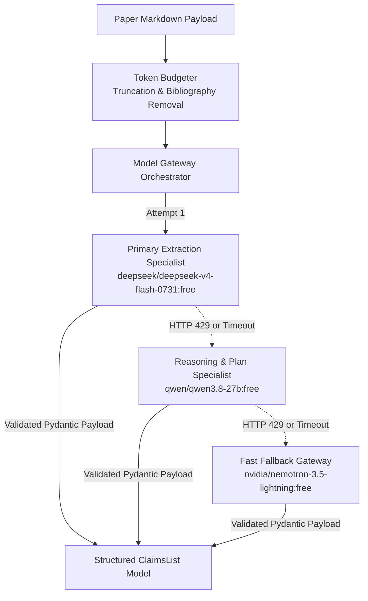
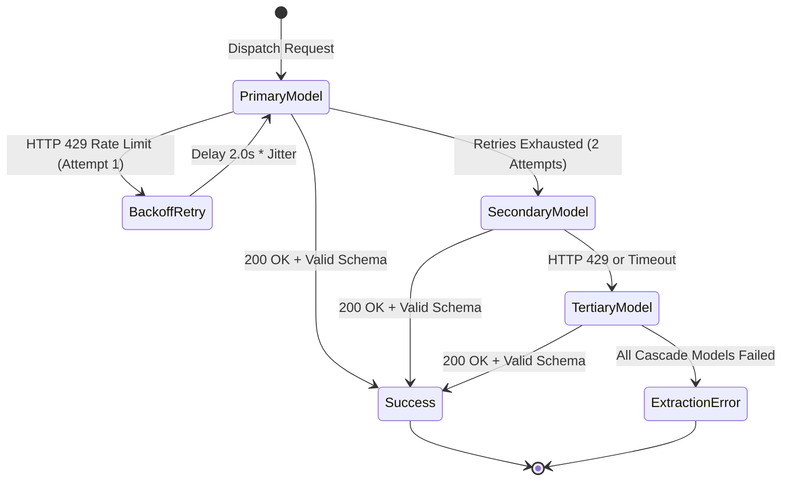

# Lego 03: LLM Engine & Model Gateway

> Technical Specification & Model Routing RFC  
> Resilient OpenRouter gateway managing structured extraction, token budgeting, and automatic cascade failover.

---

## 1. Specification Overview

The **LLM Engine & Model Gateway** provides unified, high-reliability model execution over OpenRouter's free-tier infrastructure. It translates unstructured manuscript text into validated, type-safe empirical benchmark models via strict JSON Schema enforcement. It manages token budgeting and handles automatic circuit-breaker cascades during rate limit spikes.



---

## 2. Model Routing Matrix

| Role | Primary Target | Context Budget | Primary Specialization | Failover Precedence |
| :--- | :--- | :--- | :--- | :--- |
| **Claim Extraction** | `deepseek/deepseek-v4-flash-0731:free` | 128,000 tokens | Table extraction, LaTeX math parsing, and quantitative metric extraction | Precedence 1 |
| **Replication Planning** | `qwen/qwen3.8-27b:free` | 32,000 tokens | Hardware budgeting, bash command synthesis, and script generation | Precedence 2 |
| **Fast Fallback Gateway** | `nvidia/nemotron-3.5-lightning:free` | 64,000 tokens | Low-latency response during rate limit spikes or primary gateway congestion | Precedence 3 |

---

## 3. Token Budgeting Specification

Academic preprints frequently exceed 50,000 to 100,000 characters. Sending oversized prompt bodies over free endpoints introduces request queue stalls or timeouts.

### 3.1 Bibliography Stripping
The `TokenBudgeter` searches for trailing reference markers matching the regular expression:
```
^#{1,3}\s+(?:references|bibliography|works cited)\b.*$
```
Matching headers starting after character index 500 trigger immediate document truncation, shedding up to 40% of document payload without loss of empirical content.

### 3.2 Paragraph-Bounded Truncation
1. Preprints are constrained to a strict prompt budget ceiling of `max_characters = 8000` (approximately 2,000 tokens).
2. If text exceeds this ceiling, the engine slices at the nearest preceding double-newline (`\n\n`) break.
3. An explicit truncation footer is appended, signaling that subsequent appendix sections have been pruned.

---

## 4. Structured Output Contract (JSON Schema)

Inference tasks enforce strict JSON schema deserialization conforming to the following specification:

```json
{
  "$schema": "https://json-schema.org/draft/2020-12/schema",
  "title": "ClaimsList",
  "type": "object",
  "properties": {
    "paper_title": {
      "type": ["string", "null"],
      "description": "Normalized paper title"
    },
    "claims": {
      "type": "array",
      "items": {
        "type": "object",
        "properties": {
          "benchmark_name": {
            "type": "string",
            "description": "Evaluated dataset or benchmark suite (e.g. GLUE, SQuAD)"
          },
          "target_metric": {
            "type": "string",
            "description": "Target metric evaluated (e.g. Accuracy, F1, BLEU)"
          },
          "paper_value": {
            "type": "number",
            "description": "Exact published quantitative numerical value"
          },
          "baseline_algorithm": {
            "type": "string",
            "description": "Algorithm or model variant achieving this result"
          },
          "hyperparameters": {
            "type": "object",
            "description": "Reported training hyperparameters (lr, rank, epochs, batch_size)"
          }
        },
        "required": ["benchmark_name", "target_metric", "paper_value", "baseline_algorithm"]
      },
      "description": "List of empirical claims extracted from paper text and tables"
    },
    "summary": {
      "type": "string",
      "description": "High-level empirical summary of experimental results"
    }
  },
  "required": ["claims"]
}
```

---

## 5. Failover Cascade & Circuit Breaker State Machine



1. **Attempt Bound**: Each model candidate is granted a maximum of two execution attempts.
2. **Backoff Multiplier**: Retries execute with an initial delay of 2.0 seconds multiplied by the attempt index.
3. **Failover Execution**: If the primary model fails twice, execution shifts immediately to the secondary reasoning model, followed by the fast fallback model before raising an `ExtractionError`.
