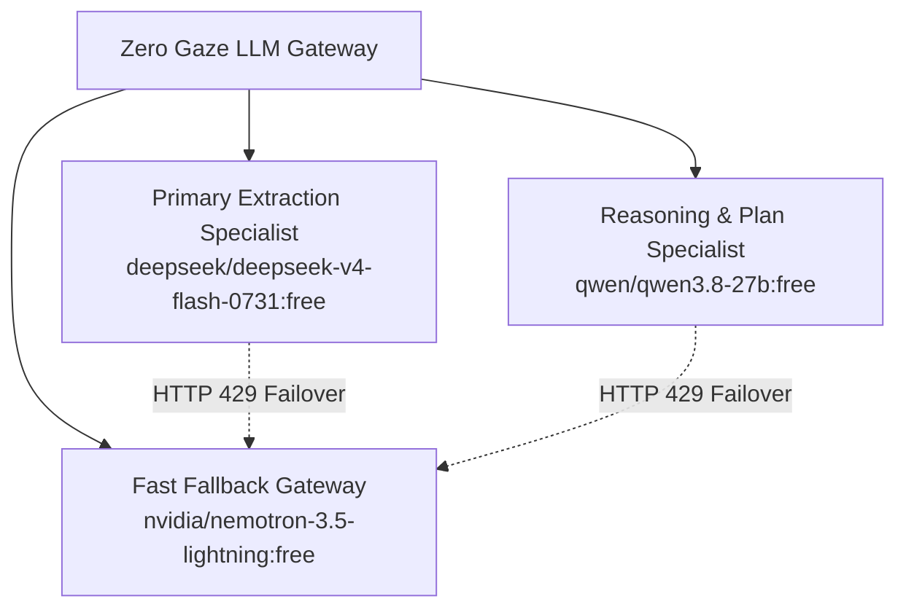

# Lego 03: LLM Engine & Model Gateway

## 1. Overview & Responsibility
The **LLM Engine & Model Gateway** provides unified, reliable LLM access through OpenRouter's free-tier endpoints. It enforces strict structured output via Pydantic schemas, manages prompt window token budgeting, and handles automatic fallback routing across model families.



---

## 2. Official Provider Documentation Links
- **OpenRouter API Documentation:** [`https://openrouter.ai/docs`](https://openrouter.ai/docs)
- **OpenRouter Free Models Catalog:** [`https://openrouter.ai/models?q=free`](https://openrouter.ai/models?q=free)
- **OpenRouter Chat Completions Endpoint:** [`https://openrouter.ai/api/v1/chat/completions`](https://openrouter.ai/api/v1/chat/completions)
- **LangChain OpenAI Chat Integration:** [`https://python.langchain.com/docs/integrations/chat/openai/`](https://python.langchain.com/docs/integrations/chat/openai/)
- **LangChain Structured Output Guide:** [`https://python.langchain.com/docs/how_to/structured_output/`](https://python.langchain.com/docs/how_to/structured_output/)

---

## 3. Model Routing Matrix

| Role | Target Model | Context Window | Primary Strength |
| :--- | :--- | :--- | :--- |
| **Claim Extraction** | `deepseek/deepseek-v4-flash-0731:free` | 128k tokens | High-accuracy extraction of tables, LaTeX, and metric numbers. |
| **Replication Planning** | `qwen/qwen3.8-27b:free` | 32k tokens | Strong architectural reasoning, hardware budgeting, and synthesis. |
| **Fallback & Synthesis** | `nvidia/nemotron-3.5-lightning:free` | 64k tokens | Low-latency response when primary models experience rate limit spikes. |

---

## 4. Implementation Pattern with LangChain & Pydantic

```python
import os
from langchain_openai import ChatOpenAI
from pydantic import BaseModel, Field


def get_llm(model_id: str = "deepseek/deepseek-v4-flash-0731:free", temperature: float = 0.0) -> ChatOpenAI:
    """Initializes an OpenRouter-backed ChatOpenAI client with verified headers."""
    api_key = os.environ.get("OPENROUTER_API_KEY")
    if not api_key:
        raise ValueError("OPENROUTER_API_KEY environment variable is required.")

    return ChatOpenAI(
        model=model_id,
        temperature=temperature,
        openai_api_key=api_key,
        openai_api_base="https://openrouter.ai/api/v1",
        default_headers={
            "HTTP-Referer": "https://github.com/riri-05/zero-gaze",
            "X-Title": "Zero Gaze ML Replication Agent",
        },
        max_retries=3,
        timeout=60,
    )


# Structured Output Extraction Pattern
class ClaimsList(BaseModel):
    benchmark_name: str
    target_metric: str
    paper_value: float
    baseline_algorithm: str
    hyperparameters: dict = Field(default_factory=dict)


def extract_structured_claims(llm: ChatOpenAI, paper_text: str) -> ClaimsList:
    structured_llm = llm.with_structured_output(ClaimsList)
    prompt = (
        "Extract the primary benchmark results, target metrics, baseline values, and "
        "hyperparameters from the following paper markdown:\n\n"
        f"{paper_text[:25000]}"
    )
    return structured_llm.invoke(prompt)
```

---

## 5. Defensive Policies
1. **Free Tier Rate Limits (HTTP 429):**
   - Configured with exponential jitter backoff (`1s`, `2s`, `4s`, `8s`).
   - If a 429 persists for 3 attempts on the primary model, the router switches automatically to the secondary or tertiary model in the matrix.
2. **Context Window Protection:**
   - Papers are token-budgeted: Abstract, Introduction, Methodology, Experiments, and Conclusion sections are prioritized, while References and Appendix raw text are truncated if context exceeds 32,000 tokens.
