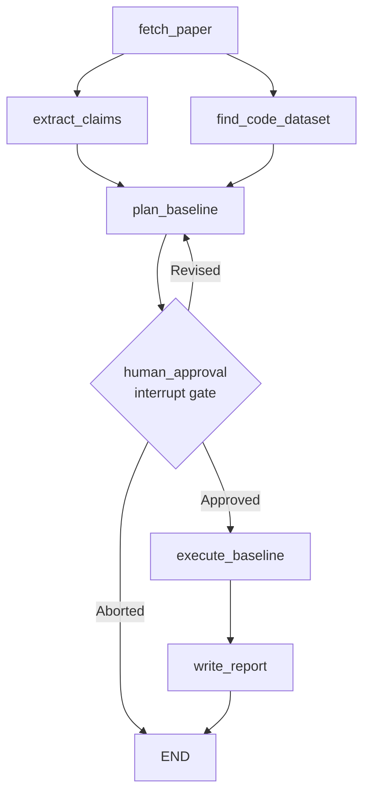

# Lego 04: StateGraph Orchestration Engine

> Technical Specification & Finite State Machine Protocol  
> Central LangGraph state machine with parallel fan-out, checkpoint persistence, and human interrupt gates.

---

## 1. Specification Overview

The **StateGraph Orchestration Engine** coordinates document parsing, claim extraction, resource discovery, replication planning, and report generation into a deterministic, stateful workflow. Built on LangGraph, it enforces typed state transitions, state checkpointing, and human authority through an explicit interrupt gate.



---

## 2. Finite State Machine (FSM) Transition Table

| Current State Node | Incoming Event / Dependency | Guard Condition | Target State Node | State Mutation Payload |
| :--- | :--- | :--- | :--- | :--- |
| **`__start__`** | Graph Invocation | Valid `paper_target` string | **`fetch_paper`** | Initial `AgentState` instantiated |
| **`fetch_paper`** | Ingestion Complete | `paper` artifact non-null | **`extract_claims`** & **`find_code_dataset`** | Parallel fan-out: `state.paper = PaperArtifact` |
| **`extract_claims`** | LLM Extraction Return | `claims` list non-empty | **`plan_baseline`** | `state.claims = list[ClaimItem]` |
| **`find_code_dataset`**| Repository Discovery Return | `code_resource` non-null | **`plan_baseline`** | `state.code_resource = CodeResource` |
| **`plan_baseline`** | Join of Claims + Code | Both branches populated | **`human_approval`** | `state.plan = ReplicationPlan` |
| **`human_approval`** | `interrupt()` Triggered | Execution halted | **Awaiting External Resume** | Transmits interrupt payload to operator |
| **Awaiting Resume** | `Command(resume=payload)` | `decision == "approved"` | **`execute_baseline`** | `state.approval = HumanApproval(APPROVED)` |
| **Awaiting Resume** | `Command(resume=payload)` | `decision == "revised"` | **`plan_baseline`** | `state.approval = HumanApproval(REVISED)` |
| **Awaiting Resume** | `Command(resume=payload)` | `decision == "aborted"` | **`__end__`** | `state.approval = HumanApproval(ABORTED)` |
| **`execute_baseline`** | Execution Result Return | Process finished | **`write_report`** | `state.execution_result = ExecutionResult` |
| **`write_report`** | Report Synthesis Return | `report` non-null | **`__end__`** | `state.report = ReplicationReport` |

---

## 3. State Reducer Invariants

The central state container `AgentState` preserves execution integrity through explicit reduction rules:

1. **Monotonic Error Accumulation**: The `errors` field utilizes `Annotated[list[str], operator.add]`. If nodes encounter non-fatal degradation, error logs append monotonically without overwriting previous diagnostic history.
2. **Field Immutability**: Intermediate fields (`paper`, `claims`, `code_resource`, `plan`, `approval`, `report`) are updated through pure replacement dictionaries emitted by nodes. Nodes never modify state objects in-place.
3. **Disjoint Fan-Out Concurrency**: During the parallel fan-out from `fetch_paper`, `extract_claims` writes exclusively to `state.claims`, while `find_code_dataset` writes exclusively to `state.code_resource`. Zero write-collision occurs across concurrent workers.

---

## 4. Checkpoint Persistence Model

State is checkpointed after every node transition using `MemorySaver`:

1. **Thread Partitioning**: Every replication workflow is assigned an isolated `thread_id` UUID. Multiple papers execute concurrently without state interference.
2. **Registered Msgpack Serialization**: Serialization boundaries register domain model tuples explicitly to guarantee schema stability across restarts.
3. **State Snapshot Inspection**: The engine allows external observers to query historical state snapshots at any time via `get_state(config)`.

---

## 5. Human-in-the-Loop Interrupt Gate Protocol

The `human_approval` node halts the state machine via LangGraph's native `interrupt()` mechanism:

### 5.1 Interrupt Request Envelope
When execution reaches the gate, the engine yields an interrupt payload:
```json
{
  "prompt": "Please review the proposed replication plan and confirm execution.",
  "paper_id": "2106.09685",
  "paper_title": "LoRA: Low-Rank Adaptation of Large Language Models",
  "plan": {
    "target_hardware": "cpu",
    "estimated_runtime_minutes": 10,
    "execution_command": "python baseline_experiment.py",
    "dependencies": ["torch", "transformers"]
  },
  "code_resource": {
    "status": "official",
    "repo_url": "https://github.com/microsoft/LoRA",
    "stars": 13800
  }
}
```

### 5.2 Resumption Contract
Execution remains suspended until an external operator or client submits a `Command(resume=payload)`:
- If `payload.decision` is `"approved"`: The conditional edge routes to `execute_baseline`, executing the approved baseline script directly in the sandbox with LLM repair fallback, followed by `write_report`.
- If `payload.decision` is `"revised"`: The conditional edge routes back to `plan_baseline` incorporating reviewer feedback into prompt re-synthesis.
- If `payload.decision` is `"aborted"`: The conditional edge routes immediately to `END`.
