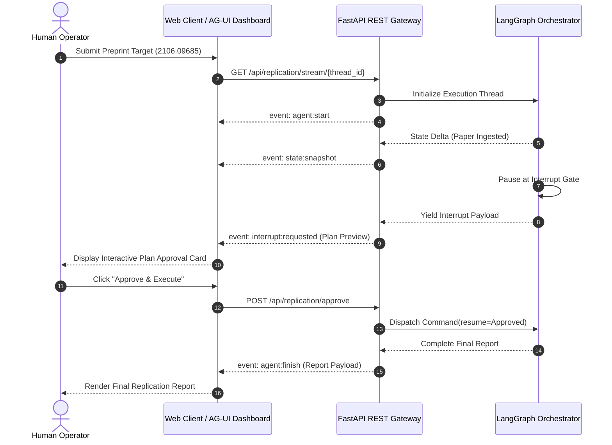

# Lego 05: Agent UI & Wire Protocol (AG-UI 1.0)

> Technical Specification & Wire Protocol RFC  
> Real-time Server-Sent Events protocol connecting LangGraph state machines with interactive user interfaces.

---

## 1. Specification Overview

The **Agent UI & Wire Protocol** module establishes bi-directional communication between the Python LangGraph orchestration backend and browser client interfaces. Running on the **AG-UI 1.0** open standard over Server-Sent Events (SSE), it streams execution deltas, displays real-time state cards, and manages human interrupt gate lifecycles.

---

## 2. AG-UI 1.0 Protocol RFC & Event Envelopes

AG-UI transmits structured events using standard MIME type `text/event-stream`. Each event is encapsulated in an envelope comprising an event identifier and a serialized JSON data payload.

### 2.1 Event Type Catalog

| Event Type | Direction | Payload Schema | Functional Semantic |
| :--- | :--- | :--- | :--- |
| **`agent:start`** | Server -> Client | `{"thread_id": string, "paper_target": string, "protocol": "AG-UI/1.0"}` | Signals agent instantiation and thread binding |
| **`node:transition`** | Server -> Client | `{"thread_id": string, "node": string, "status": "running" \| "completed"}` | Real-time pipeline stepper status update |
| **`state:delta`** | Server -> Client | `{"thread_id": string, "delta": object}` | Emits incremental state mutations from individual nodes |
| **`state:snapshot`**| Server -> Client | `{"thread_id": string, "state": AgentState}` | Full state synchronization of the active checkpoint |
| **`interrupt:requested`** | Server -> Client | `{"thread_id": string, "prompt": string, "plan": object, "code_resource": object}` | Halts UI stream and displays operator confirmation card |
| **`interrupt:resolved`** | Client -> Server | `{"thread_id": string, "decision": "approved" \| "aborted" \| "revised"}` | Signals operator verdict to resume state machine |
| **`execution:stdout`** | Server -> Client | `{"thread_id": string, "chunk": string}` | Real-time terminal log chunk emitted from execution sandbox |
| **`agent:finish`** | Server -> Client | `{"thread_id": string, "status": "completed", "report": ReplicationReport}` | Signals terminal completion and delivers final markdown report |
| **`agent:error`** | Server -> Client | `{"thread_id": string, "error": string}` | Emits diagnostic details on unrecoverable failure |
---

## 3. REST API Endpoint Specification

The FastAPI presentation service exposes the following HTTP endpoints:

| Method | Endpoint Path | Request Body | Response Status | Functional Description |
| :--- | :--- | :--- | :--- | :--- |
| **GET** | `/health` | None | `200 OK` | Liveness and health check |
| **GET** | `/` | None | `200 OK (text/html)` | Serves the production React 19 + TypeScript + Tailwind replication cockpit |
| **POST** | `/api/replication/start` | `StartReplicationRequest` | `200 OK` | Starts replication pipeline up to the interrupt gate |
| **POST** | `/api/replication/approve`| `ApproveReplicationRequest`| `200 OK` | Resolves the interrupt gate and resumes execution |
| **GET** | `/api/replication/state/{id}`| None | `200 OK` / `404 Not Found` | Queries current state checkpoint snapshot |
| **GET** | `/api/replication/stream/{id}`| Query: `paper_target` | `200 OK (text/event-stream)` | Opens AG-UI 1.0 real-time SSE event stream |
| **POST** | `/api/copilotkit` | `dict[str, Any]` | `200 OK` | AG-UI compatibility handshake for CopilotKit clients |

---

## 4. Security & Network Invariants

1. **Cross-Origin Resource Sharing (CORS)**: Pre-configured to allow local frontend development servers (`http://localhost:3000`) with permissive origin headers, credentials, and methods.
2. **Buffering Disabled**: The SSE streaming endpoint explicitly sends `X-Accel-Buffering: no` and `Cache-Control: no-cache` headers to prevent reverse proxies (e.g. Nginx, Cloudflare) from buffering live agent thought streams.
3. **Connection Liveness**: The stream generator maintains a persistent keep-alive heartbeat until the terminal `agent:finish` or `agent:error` event is emitted.
