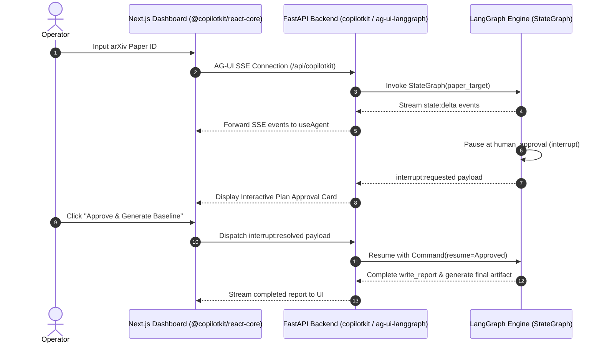

# Lego 05: Agent UI & Wire Protocol (CopilotKit 2.0 / AG-UI 1.0)

## 1. Overview & Responsibility
The **Agent UI & Wire Protocol** module establishes real-time, bi-directional communication between the Python LangGraph backend and the React/Next.js frontend. It runs on the newly released **AG-UI 1.0** (Agent-User Interaction) open protocol over Server-Sent Events (SSE).

It enables:
1. Streaming agent thoughts, state transitions, and tool calls.
2. Generative UI cards rendering paper claims, discovered code, and plan summaries.
3. Human-in-the-Loop interactive modals triggered directly when LangGraph executes `interrupt()`.



---

## 2. Official Provider Documentation Links
- **CopilotKit Documentation:** [`https://docs.copilotkit.ai/`](https://docs.copilotkit.ai/)
- **AG-UI Protocol Specification:** [`https://docs.copilotkit.ai/ag-ui`](https://docs.copilotkit.ai/ag-ui)
- **LangGraph Python Runtime Guide:** [`https://docs.copilotkit.ai/langgraph-python/quickstart`](https://docs.copilotkit.ai/langgraph-python/quickstart)
- **CopilotKit Python SDK Repository:** [`https://github.com/CopilotKit/CopilotKit/tree/main/sdk-python`](https://github.com/CopilotKit/CopilotKit/tree/main/sdk-python)
- **useAgent Hook Reference:** [`https://docs.copilotkit.ai/reference/v2/sdk/react/useAgent`](https://docs.copilotkit.ai/reference/v2/sdk/react/useAgent)

---

## 3. Wire Protocol & Event Hierarchy (AG-UI 1.0)

AG-UI transmits structured events over `text/event-stream`:
- `agent:start` / `agent:finish`: Lifecycle demarcations.
- `state:delta` / `state:snapshot`: Synchronization of `AgentState` Pydantic models.
- `interrupt:requested`: Transmitted when LangGraph hits `human_approval`. Carries the plan payload.
- `interrupt:resolved`: Dispatched by the frontend when the operator clicks "Approve" or "Revise".

---

## 4. Backend Implementation (FastAPI + AG-UI)

```python
from fastapi import FastAPI
from fastapi.middleware.cors import CORSMiddleware
from zero_gaze.server.app import create_app
from zero_gaze.server.routes import router

# Factory creating configured FastAPI service
app = create_app()

# CLI entry point to launch server
# zero-gaze serve --host 127.0.0.1 --port 8000
```

---

## 5. Frontend Implementation (Next.js + React)

```tsx
"use client";

import { CopilotKit, useAgent } from "@copilotkit/react-core/v2";
import { CopilotChat } from "@copilotkit/react-ui";
import "@copilotkit/react-ui/styles.css";

function ReplicationDashboard() {
  const { agent } = useAgent({ agentId: "zero_gaze_agent" });

  return (
    <div className="flex h-screen bg-neutral-950 text-white">
      {/* Main Workspace: Claims, Code, Plan */}
      <main className="flex-1 p-8 overflow-y-auto">
        <h1 className="text-2xl font-bold tracking-tight mb-4">Zero Gaze</h1>
        
        {agent.state?.plan && (
          <div className="rounded-xl border border-neutral-800 bg-neutral-900/50 p-6">
            <h2 className="text-lg font-semibold text-emerald-400">Replication Plan</h2>
            <pre className="mt-2 text-sm text-neutral-300">
              {JSON.stringify(agent.state.plan, null, 2)}
            </pre>
            
            {/* Human in the loop confirmation button */}
            {agent.state.approval?.decision === "pending" && (
              <div className="mt-4 flex gap-3">
                <button 
                  onClick={() => agent.resolveInterrupt({ decision: "approved" })}
                  className="px-4 py-2 bg-emerald-600 hover:bg-emerald-500 rounded-lg font-medium"
                >
                  Approve & Generate Baseline
                </button>
                <button 
                  onClick={() => agent.resolveInterrupt({ decision: "aborted" })}
                  className="px-4 py-2 bg-rose-600 hover:bg-rose-500 rounded-lg font-medium"
                >
                  Abort
                </button>
              </div>
            )}
          </div>
        )}
      </main>

      {/* CopilotKit Chat Sidebar */}
      <aside className="w-96 border-l border-neutral-800">
        <CopilotChat 
          labels={{
            title: "Zero Gaze Copilot",
            initial: "Paste an arXiv URL to extract claims and draft a replication plan."
          }}
        />
      </aside>
    </div>
  );
}

export default function App() {
  return (
    <CopilotKit runtimeUrl="http://localhost:8000/api/copilotkit">
      <ReplicationDashboard />
    </CopilotKit>
  );
}
```
