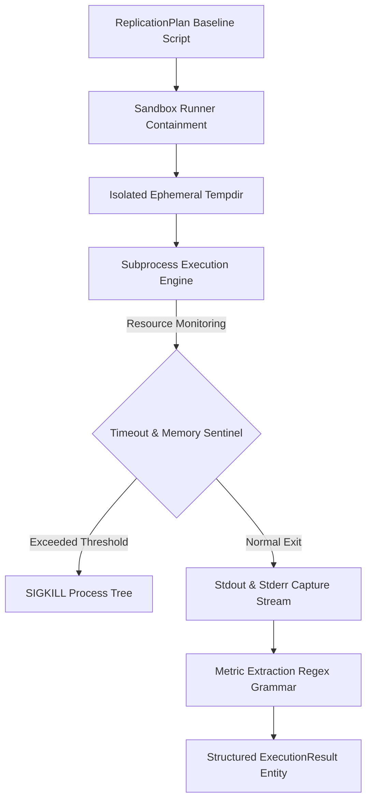

# Lego 06: Zero-Setup Execution & Kaggle Runtime

> Technical Specification & Sandbox Containment Protocol  
> Resource-bounded experiment execution, process isolation, and metric extraction grammar.

---

## 1. Specification Overview

The **Zero-Setup Execution & Kaggle Runtime** provides isolated, reproducible evaluation of synthesized replication scripts. It guarantees that generated experiment code runs in an ephemeral, resource-bounded environment without host pollution. It targets both local sandboxed subprocesses and standalone Kaggle free-tier GPU instances (NVIDIA Tesla T4).



---

## 2. Process Containment & Resource Bounds

Baseline replication code generated by an LLM is treated as untrusted. The execution sandbox enforces strict operating boundaries:

| Resource Boundary | Local Sandbox Default | Kaggle Runtime Allocation | Enforcement Mechanism |
| :--- | :--- | :--- | :--- |
| **Execution Timeout** | 60.0 seconds (configurable) | 600.0 seconds per baseline run | Python `subprocess.TimeoutExpired` / OS alarm |
| **Filesystem Scope** | Ephemeral `tempfile.TemporaryDirectory` | 20GB scratch disk (`/kaggle/working`) | Auto-pruned directory context manager |
| **Process Tree** | Isolated process group (`start_new_session=True`) | Single Jupyter kernel instance | Process group `os.killpg` SIGTERM/SIGKILL termination on exit or timeout |
| **Environment Security** | Whitelisted safe variables, host secrets stripped | Notebook environment variables | Strips `OPENROUTER_API_KEY`, tokens, and credentials from subprocess |
| **Memory Ceiling** | Bounded by system swap/OOM | 16GB GPU VRAM / 30GB System RAM | Linux cgroups / kernel OOM killer |
| **Network Egress** | Permitted for package downloads | Toggle-dependent (`Internet: On`) | Pre-flight network socket verification |

---

## 3. Metric Extraction Grammar

The sandbox parses standard quantitative metrics emitted by experiment scripts into a typed key-value dictionary. Output parsing adheres to three deterministic regular expression grammars:

### 3.1 Parenthesized Metrics
```
Metric\s*\(([^)]+)\)\s*:\s*([0-9.]+)
```
Matches structured logs such as `Metric (Accuracy): 94.2%` or `Metric (BLEU): 28.4`.

### 3.2 Quoted Attribute Metrics
```
Metric\s*['\"]([^'\"]+)['\"]\s*:\s*([0-9.]+)
```
Matches quoted key logs such as `Metric 'loss': 0.042`.

### 3.3 Alphanumeric Key-Value Assignments
```
([a-zA-Z0-9_\-]+)\s*=\s*([0-9.]+)%?
```
Matches assignment logs such as `F1 = 91.8` or `val_accuracy = 89.2`.

---

## 4. Data Contract Specification

Execution yields an immutable `ExecutionResult` model conforming to this formal JSON Schema:

```json
{
  "$schema": "https://json-schema.org/draft/2020-12/schema",
  "title": "ExecutionResult",
  "type": "object",
  "properties": {
    "success": {
      "type": "boolean",
      "description": "True if process exited with code 0 without timing out"
    },
    "exit_code": {
      "type": "integer",
      "description": "Process exit return code (-1 on timeout or signal termination)"
    },
    "stdout": {
      "type": "string",
      "description": "Captured standard output stream"
    },
    "stderr": {
      "type": "string",
      "description": "Captured standard error diagnostic stream"
    },
    "runtime_seconds": {
      "type": "number",
      "minimum": 0.0,
      "description": "Wall-clock execution duration in seconds"
    },
    "output_metrics": {
      "type": "object",
      "additionalProperties": { "type": "number" },
      "description": "Extracted empirical quantitative metrics"
    },
    "error_message": {
      "type": ["string", "null"],
      "description": "Diagnostic error description on failure or timeout"
    }
  },
  "required": ["success", "exit_code", "stdout", "stderr", "runtime_seconds", "output_metrics"]
}
```

---

## 5. Kaggle Free Hardware Constraints & Invariants

1. **Quota Management**: Kaggle provides 30 weekly GPU hours. Baseline experiments are budgeted for 5 to 15 minutes to preserve user quota.
2. **Pre-flight Network Assertion**: The standalone notebook asserts internet connectivity prior to calling arXiv or OpenRouter APIs, notifying the operator if the sidebar toggle is disabled.
3. **In-Cell Interrupt Resumption**: Interactive button widgets (`ipywidgets.Button`) replace web modals, maintaining strict Human-in-the-Loop parity inside headless notebook cells.
4. **Packaged Artifact**: The self-contained notebook is distributed at `notebooks/zero_gaze_kaggle_free.ipynb`.
