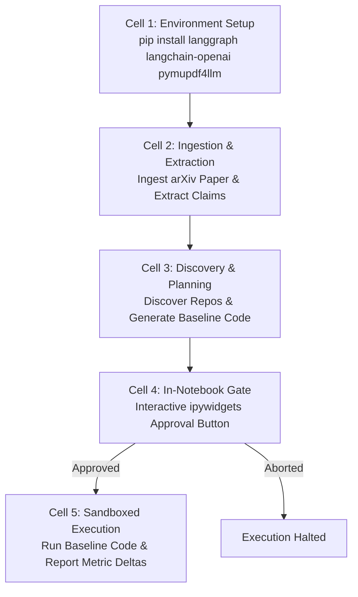

# Lego 06: Zero-Setup Execution & Kaggle Notebook Runtime

## 1. Overview & Responsibility
The **Zero-Setup Execution & Kaggle Notebook Runtime** guarantees that anyone can evaluate and run Zero Gaze without a local development environment, Node.js installation, or high-end GPU hardware.

It packages the entire pipeline into a single, self-contained Jupyter notebook (`zero_gaze_kaggle_free.ipynb`) optimized for Kaggle's free tier (T4 GPU / 16GB RAM / 30 hours weekly quota).



---

## 2. Official Provider Documentation Links
- **Kaggle Notebooks Documentation:** [`https://www.kaggle.com/docs/notebooks`](https://www.kaggle.com/docs/notebooks)
- **Kaggle Python Docker Environment:** [`https://github.com/Kaggle/docker-python`](https://github.com/Kaggle/docker-python)
- **Kaggle GPU & Resource Quotas:** [`https://www.kaggle.com/docs/efficient-gpu-usage`](https://www.kaggle.com/docs/efficient-gpu-usage)
- **ipywidgets Documentation:** [`https://ipywidgets.readthedocs.io/`](https://ipywidgets.readthedocs.io/)
- **Polars Fast DataFrame Documentation:** [`https://docs.pola.rs/`](https://docs.pola.rs/)

---

## 3. Kaggle Free Hardware Budget & Resource Constraints

| Resource | Kaggle Free Quota | Zero Gaze Budget Allocation |
| :--- | :--- | :--- |
| **GPU** | 1x NVIDIA Tesla T4 (16GB VRAM) | Reserved for baseline model execution / inference. |
| **CPU / RAM** | 4 vCPU / 30GB System RAM | Graph execution, PDF parsing, tokenization. |
| **Disk Space** | 20GB scratch space | Dataset caching and PyTorch checkpoints. |
| **Network** | Internet access toggle required | arXiv API, PapersWithCode, OpenRouter calls. |
| **Runtime Limit** | 9 hours continuous | Baseline runs capped at 10 minutes maximum. |

---

## 4. In-Notebook Human-in-the-Loop Implementation

Instead of requiring an external web browser or Next.js server, the Kaggle runtime replaces the HTTP AG-UI approval modal with native Python `ipywidgets` or cell-level resumption:

```python
import ipywidgets as widgets
from IPython.display import display


def handle_kaggle_approval(graph, config, plan_payload):
    """Displays an interactive approval widget inside a Kaggle notebook cell."""
    print("=== REPLICATION PLAN GENERATED ===")
    print(f"Target Hardware: {plan_payload['plan']['target_hardware']}")
    print(f"Command: {plan_payload['plan']['execution_command']}")

    btn_approve = widgets.Button(
        description="Approve & Run Baseline",
        button_style="success",
        icon="check",
    )
    btn_abort = widgets.Button(
        description="Abort Execution",
        button_style="danger",
        icon="times",
    )

    output = widgets.Output()

    def on_approve(_):
        with output:
            print("Plan approved! Resuming LangGraph StateGraph...")
            # Resume graph execution passing approval payload
            graph.invoke(
                {"approval": {"decision": "approved"}},
                config=config,
            )

    def on_abort(_):
        with output:
            print("Execution aborted by operator.")
            graph.invoke(
                {"approval": {"decision": "aborted"}},
                config=config,
            )

    btn_approve.on_click(on_approve)
    btn_abort.on_click(on_abort)

    display(widgets.HBox([btn_approve, btn_abort]), output)
```

---

## 5. Defense Against Notebook Failures
1. **Network Disabled Toggle:**
   - The notebook starts with an assertion checking internet connectivity. If internet is disabled, it outputs clear instructions on toggling "Internet: On" in the Kaggle sidebar.
2. **Deterministic Fallback Data:**
   - To guard against arXiv downtime during recruiter evaluations, the notebook bundles a pre-cached markdown artifact of the classic *LoRA: Low-Rank Adaptation of Large Language Models* (arXiv:2106.09685) so the notebook can execute even offline.

---

## 6. Packaged Notebook & Execution Sandbox

The complete runtime is packaged in [`notebooks/zero_gaze_kaggle_free.ipynb`](../../notebooks/zero_gaze_kaggle_free.ipynb).
Generated baseline scripts are executed inside the ephemeral sandbox via `zero_gaze.execution`:

```python
from zero_gaze.execution import SandboxRunner

sandbox = SandboxRunner(timeout_seconds=60.0)
result = sandbox.execute_script(plan.baseline_script)
print(f"Success: {result.success}, Exit: {result.exit_code}")
print("Captured metrics:", result.output_metrics)
```
