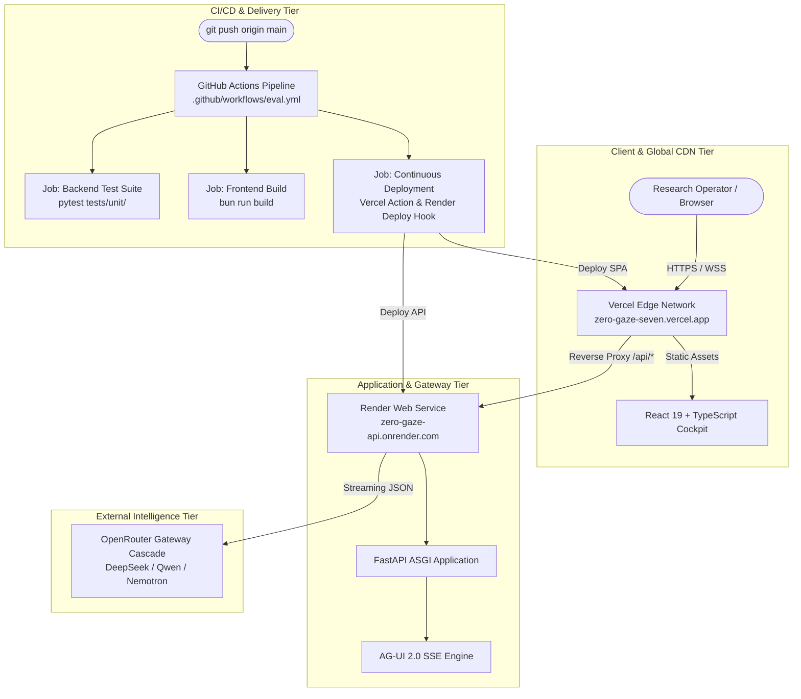

# Lego 07: Cloud Deployment & Distributed Operations

> Technical Specification & Production Infrastructure Architecture  
> Multi-cloud production deployment topology spanning Render Web Services, Vercel Edge Network, and GitHub Actions CI/CD automation.

---

## 1. Production Deployment Topology

Zero Gaze utilizes a decoupled cloud architecture designed for high availability, low-latency client delivery, and isolated compute execution:



---

## 2. Infrastructure Specifications

### 2.1 Vercel Edge Frontend Service

| Parameter | Production Value | Description |
| :--- | :--- | :--- |
| **Project Name** | `zero-gaze` | Project identifier under `aditya-ai-architects-projects` |
| **Project ID** | `prj_jTRdXZynlAg9TqL5Af24D8B0biN0` | Immutable Vercel project identifier |
| **Org / Team ID** | `team_FUcs8fFoJOSKweY8QRIvuKW9` | Active Vercel organization |
| **Production Domain** | `https://zero-gaze-seven.vercel.app` | Global edge endpoint |
| **Framework Target** | Vite (React 19 + TypeScript + Tailwind) | Modern client build |
| **Build Command** | `bun run build` (`tsc && vite build`) | Production typecheck and bundle |
| **Output Directory** | `dist` | Static asset output directory |
| **Reverse Proxy** | `/api/:path*` -> `https://zero-gaze-api.onrender.com/api/:path*` | Direct zero-CORS API routing |

### 2.2 Render Application Service

| Parameter | Production Value | Description |
| :--- | :--- | :--- |
| **Service Name** | `zero-gaze-api` | Web service resource |
| **Service ID** | `srv-dan9tov40ujc73b77sa0` | Unique Render resource ID |
| **Production Domain** | `https://zero-gaze-api.onrender.com` | Backend application endpoint |
| **Runtime Environment** | Python 3.11.9 | Standard Debian Linux container |
| **Build Command** | `pip install -e '.[dev]'` | Installs project and dependencies |
| **Start Command** | `uvicorn zero_gaze.server.app:app --host 0.0.0.0 --port $PORT` | Production ASGI web server |
| **Health Check Path** | `/health` and `/api/health` | Automated zero-downtime deployment health check |
| **Auto-Deploy** | Enabled (`commit` trigger on `main`) | Automated Git deployment on push |

---

## 3. Infrastructure as Code (IaC)

### 3.1 Render Blueprint (`render.yaml`)

The backend service is managed through Render's declarative Blueprint specification:

```yaml
services:
  - type: web
    name: zero-gaze-api
    runtime: python
    plan: free
    region: oregon
    branch: main
    repo: https://github.com/riri-05/zero-gaze
    buildCommand: "pip install -e '.[dev]'"
    startCommand: "uvicorn zero_gaze.server.app:app --host 0.0.0.0 --port $PORT"
    healthCheckPath: /health
    autoDeploy: true
    envVars:
      - key: PYTHON_VERSION
        value: 3.11.9
      - key: PRIMARY_MODEL
        value: deepseek/deepseek-v4-flash-0731:free
      - key: REASONING_MODEL
        value: qwen/qwen3.8-27b:free
      - key: FAST_MODEL
        value: nvidia/nemotron-3.5-lightning:free
      - key: OPENROUTER_API_KEY
        sync: false
```

Validate changes locally before committing:
```bash
render blueprints validate ./render.yaml
```

### 3.2 Vercel Configuration (`frontend/vercel.json`)

```json
{
  "framework": "vite",
  "buildCommand": "bun run build",
  "outputDirectory": "dist",
  "rewrites": [
    {
      "source": "/api/:path*",
      "destination": "https://zero-gaze-api.onrender.com/api/:path*"
    },
    {
      "source": "/(.*)",
      "destination": "/index.html"
    }
  ]
}
```

---

## 4. Multi-Stage CI/CD Pipeline

The `.github/workflows/eval.yml` workflow enforces quality gates prior to production deployment:

1. **`backend-test`**: Sets up Python 3.11, installs project dependencies and CPU PyTorch, executes the 64-test pytest unit test suite (`pytest tests/unit/ -v`), and validates the full replication evaluation harness (`python tests/eval_papers.py`).
2. **`frontend-build`**: Sets up Bun 1.4+, installs frontend dependencies with frozen lockfiles, and validates strict TypeScript compilation (`bun run build`).
3. **`deploy`**: Executes exclusively on commits to the `main` branch once test and build jobs pass. Uses `amondnet/vercel-action@v25` to deploy frontend assets to Vercel and triggers the Render API deploy hook.

---

## 5. Operational Runbooks

### 5.1 Inspecting Live Production Logs

To view real-time backend logs from Render:
```bash
render logs --resources srv-dan9tov40ujc73b77sa0
```

To view frontend build and deployment telemetry from Vercel:
```bash
vercel inspect zero-gaze-seven.vercel.app
```

### 5.2 Manual Production Deployment

Deploying frontend directly via Vercel CLI:
```bash
cd frontend
vercel deploy --prod --yes
```

Deploying backend directly via Render CLI:
```bash
render deploys create srv-dan9tov40ujc73b77sa0 --confirm
```

### 5.3 Health & Uptime Monitoring

- Backend health: `curl -s https://zero-gaze-api.onrender.com/health` -> `{"status":"ok","service":"zero-gaze-agent","version":"0.1.0"}`
- Frontend availability: `curl -sI https://zero-gaze-seven.vercel.app` -> `HTTP/2 200 OK`
- Proxy route check: `curl -s https://zero-gaze-seven.vercel.app/api/health` -> `{"status":"ok",...}`
